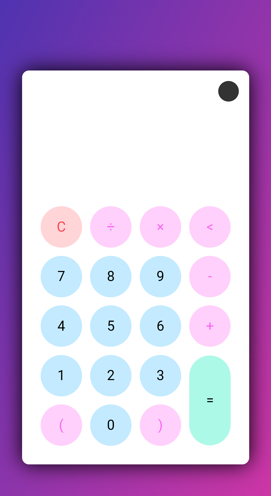
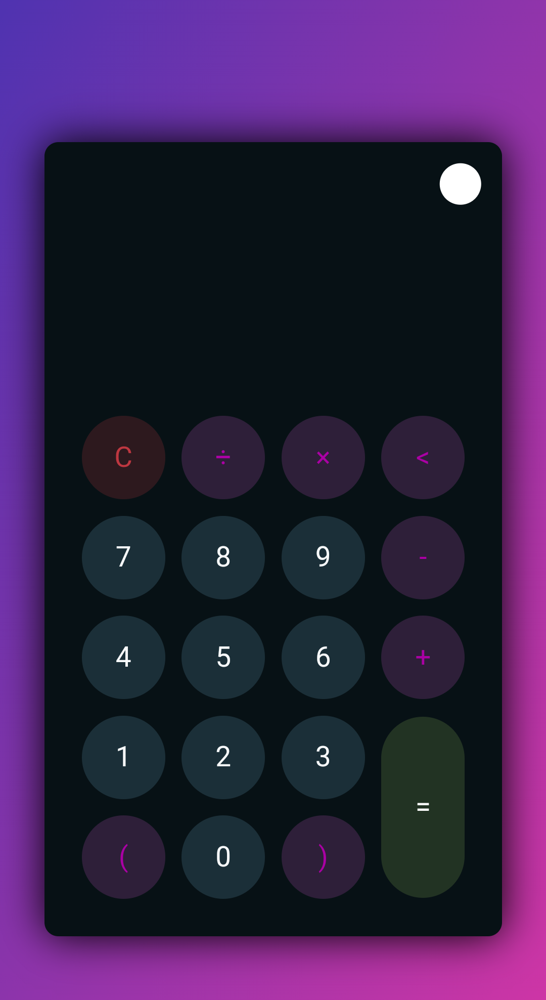

# Calculator

A simple calculator web application with light and dark mode themes.

## Features

- **Basic Arithmetic Operations**: Addition, subtraction, multiplication, and division.
- **Light and Dark Mode**: Easily switch between light and dark themes for better visibility.
- **Responsive Design**: Optimized for various screen sizes, including mobile devices.

## Screenshots

### Light Mode

### Dark Mode

## Technologies Used

- HTML
- CSS
- JavaScript

## How to Use

1. Open `index.html` in your web browser.
2. Use the buttons to perform arithmetic operations.
3. Toggle between light and dark mode using the theme toggler button.

## License

This project is licensed under the MIT License. See the [LICENSE](LICENSE) file for details.
